# Tugas Practice 13 — Sistem Manajemen Produk, Role, & Pesanan

- **Nama:** Fazilatun Nisa Muslimah
- **NIM:** 20250140119
- **Repo fork:** https://github.com/fazila7002/PAW-ANTARA-WEEK13-20250140119
- **Source:** https://github.com/Kakonoomoide/PAW-ANTARA-WEEK13

Akun demo (dari `npm run seed`):

| Role | Username | Password |
|------|----------|----------|
| Admin | `admin` | `admin123` |
| Customer | `budi` | `budi123` |
| Customer | `sari` | `sari123` |

Semua screenshot ada di [`docs/screenshot/`](docs/screenshot).

---

## 1. Data Produk (banyak, bukan 1-2 dummy)

Seeder mengisi **25 produk** dari 3 kategori (atasan, bawahan, sepatu & aksesoris),
lengkap dengan harga dan stok yang beda-beda — lihat [`seeders/seed.js`](seeders/seed.js).

Halaman kelola produk sisi admin, 25 baris data:

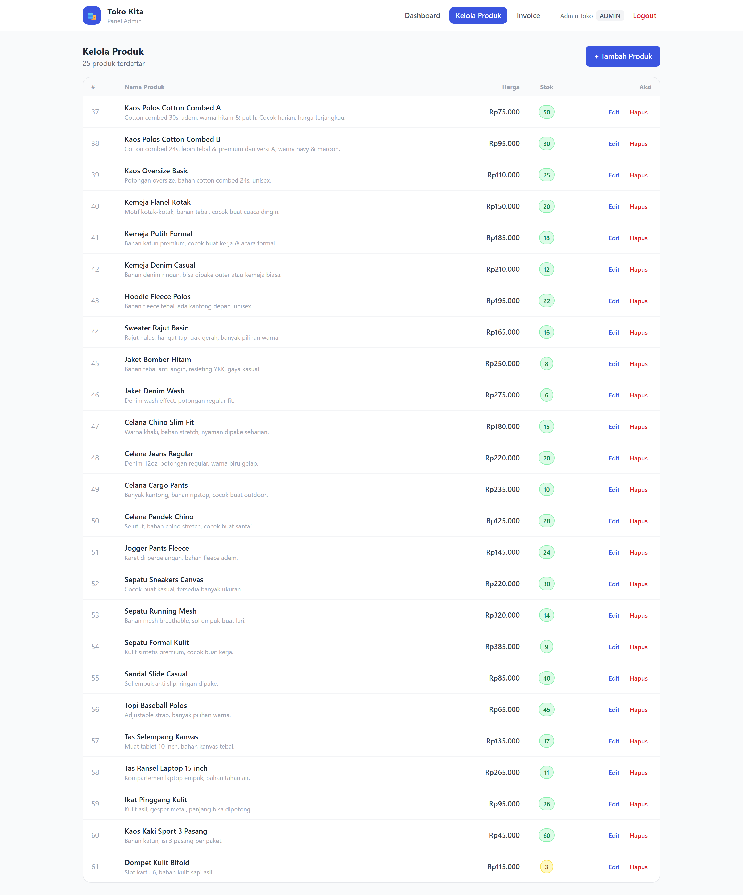

Katalog yang dilihat customer, semua produk tampil sebagai kartu:


---

## 2. CRUD Produk oleh Admin

Semua aksi CRUD ada di [`controllers/admin.controller.js`](controllers/admin.controller.js),
dengan logic + validasi terpusat di [`services/product.service.js`](services/product.service.js).

### CREATE — before → after

Form tambah produk diisi (**before**): produk "Jaket Parasut Windbreaker", Rp189.000, stok 12.

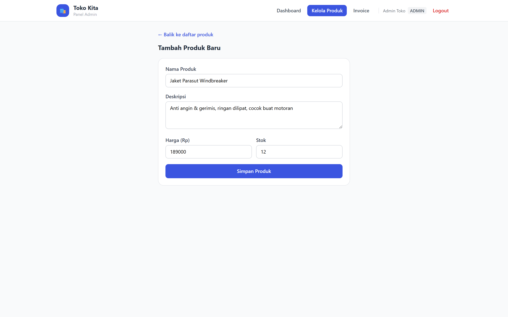

Setelah disimpan (**after**): produk baru masuk ke daftar, jumlah produk jadi 26 dan
muncul notifikasi berhasil.

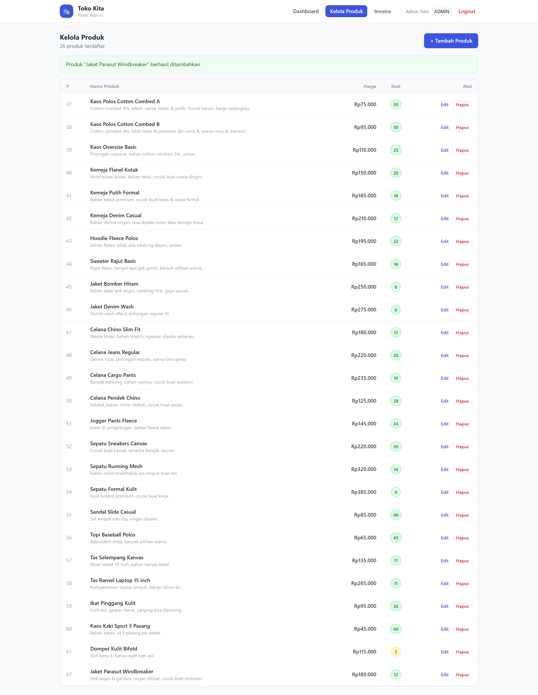

### UPDATE — before → after

Form edit produk yang sama, nama diubah jadi "...PRO", harga jadi Rp215.000, stok jadi 20 (**before**):

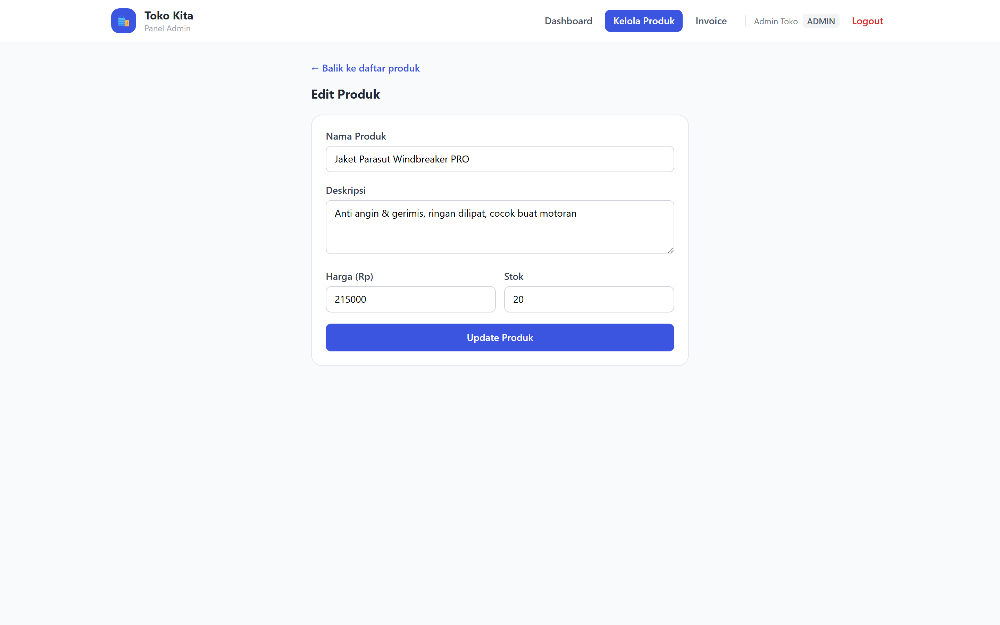

Setelah diupdate (**after**): nama & harga di tabel ikut berubah.


### Validasi server-side

Harga diisi 0 → ditolak server, bukan cuma dicegat HTML `required`:

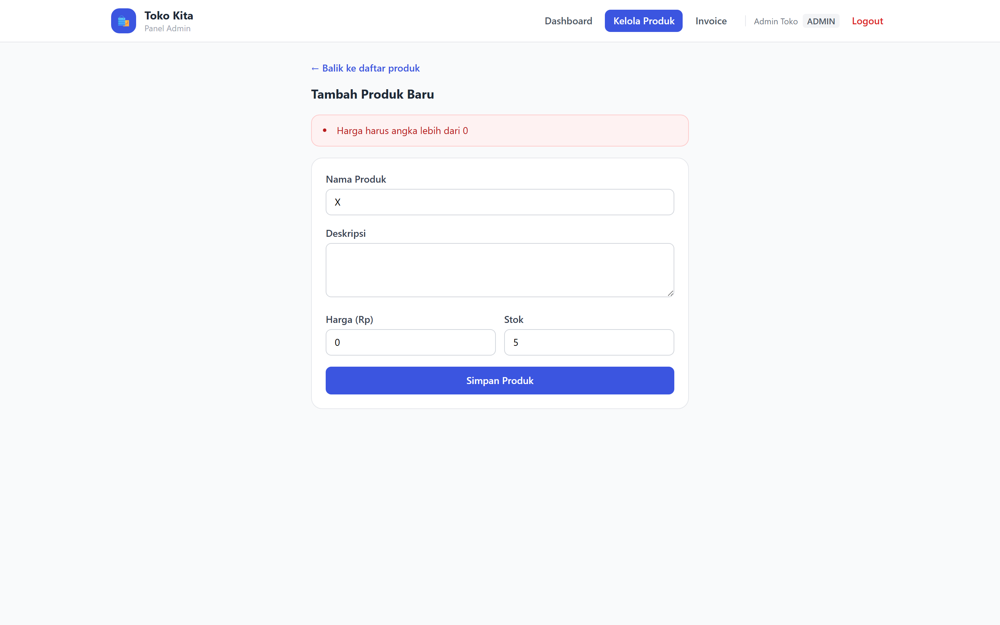

### DELETE — before → after

Baris produk yang akan dihapus (ditandai kotak merah) (**before**):

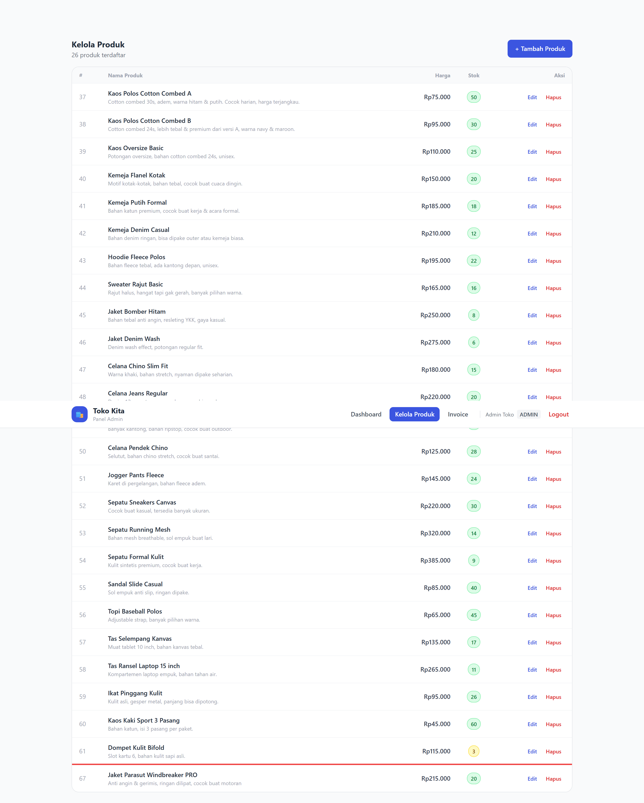

Setelah dihapus (**after**): produk hilang dari tabel, jumlah balik jadi 25.

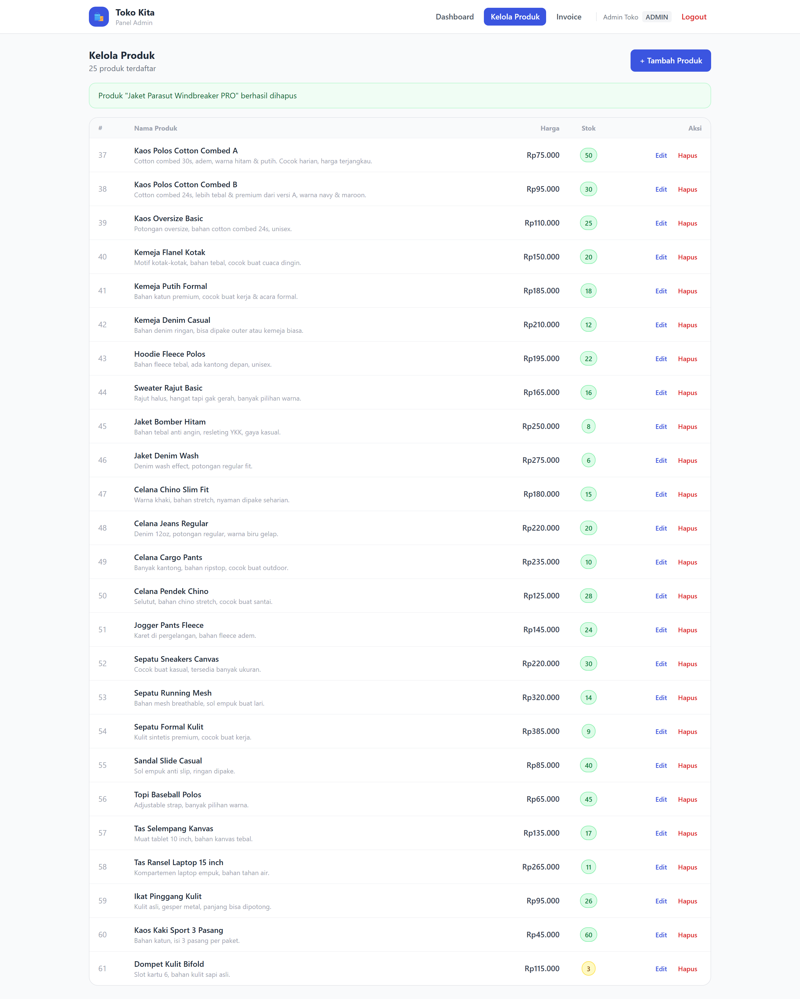

---

## 3. Login 2 Role: Customer & Admin

Autentikasi pakai `express-session` + `bcrypt`. Role disimpan di kolom `role`
([`models/user.model.js`](models/user.model.js)) dan dicek lewat middleware
[`middlewares/auth.middleware.js`](middlewares/auth.middleware.js).

Halaman login (satu form untuk dua role):

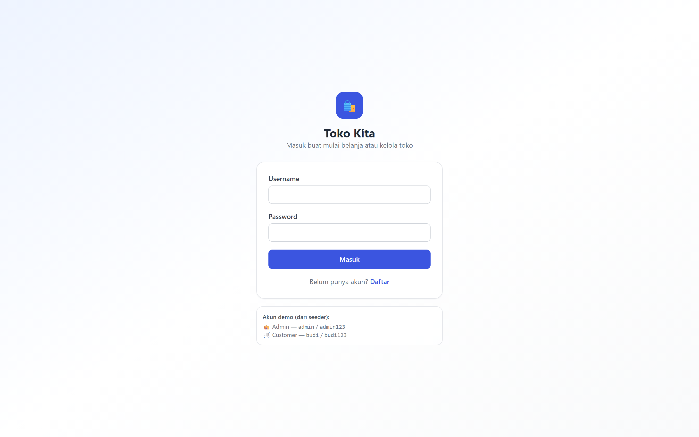

**Login sebagai admin** → otomatis diarahkan ke `/admin`, tampilannya Panel Admin
(Dashboard, Kelola Produk, Invoice):

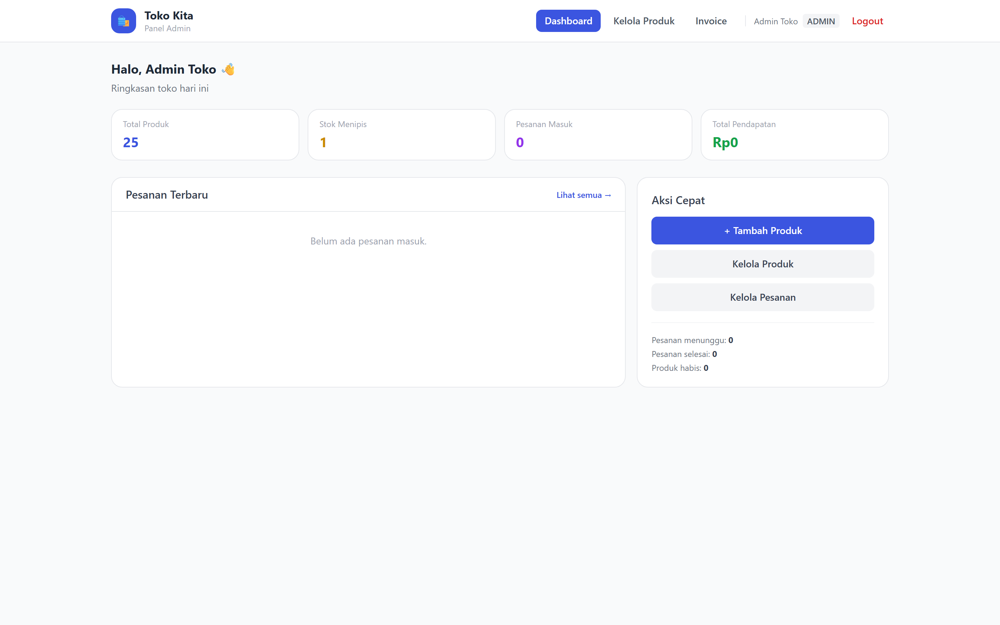

**Login sebagai customer** → diarahkan ke `/` (katalog belanja + keranjang + chat AI),
menu navbarnya beda (Katalog & Chat, Pesanan Saya):

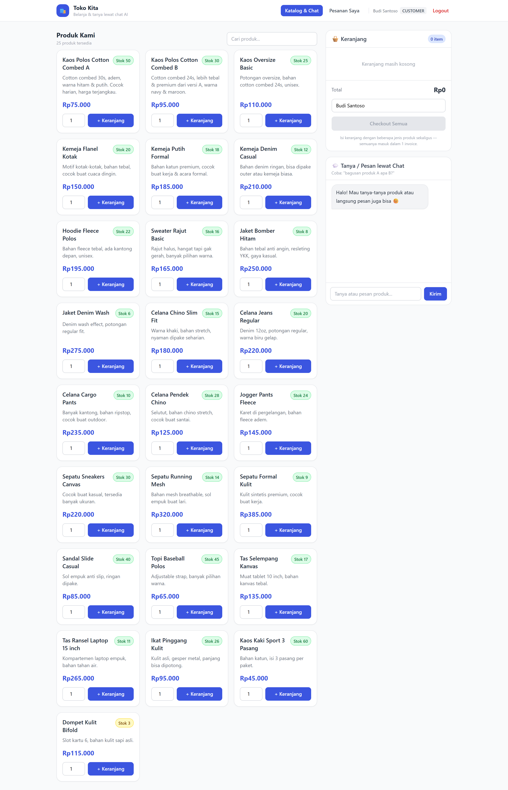

Kalau customer maksa buka halaman admin, ditolak middleware `requireRole('admin')`:

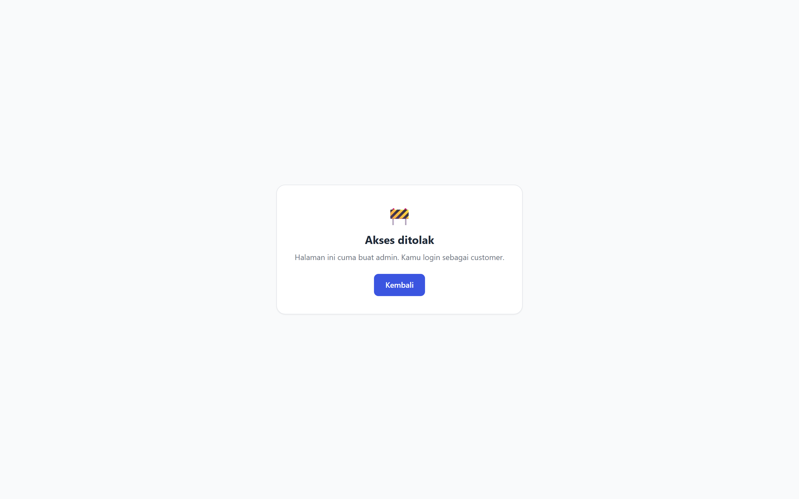

---

## 4. Multiple Order dalam 1 Pemesanan

**Masalah versi lama:** tabel `orders` punya kolom `productId` langsung, jadi 1 order
cuma bisa 1 produk. **Solusi:** dipecah jadi dua tabel dengan relasi:

```
Order (header: pembeli, total, status) ──< OrderItem (produk, qty, harga) >── Product
```

- [`models/order.model.js`](models/order.model.js) — header invoice
- [`models/orderItem.model.js`](models/orderItem.model.js) — baris produk per invoice
- [`services/order.service.js`](services/order.service.js) — `createOrder({ items: [...] })`
  menerima **array** item dan diproses dalam satu **database transaction**
  (kalau salah satu stok kurang, semua dibatalkan — gak ada order setengah jadi)

Customer memasukkan **3 jenis produk** ke keranjang sekaligus (2 + 1 + 3 = 6 barang):

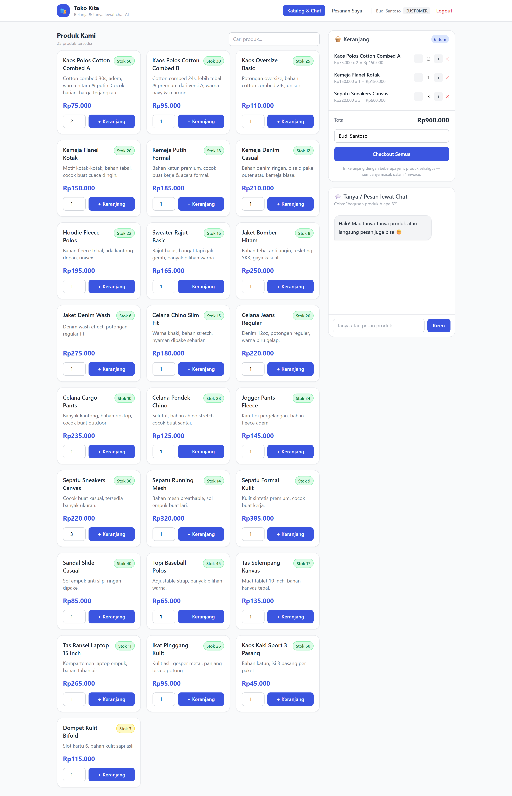

Setelah checkout, **ketiganya tersimpan dalam 1 invoice** (bukan cuma 1 yang kepesan),
total Rp960.000 (2 kaos + 1 kemeja + 3 sepatu):

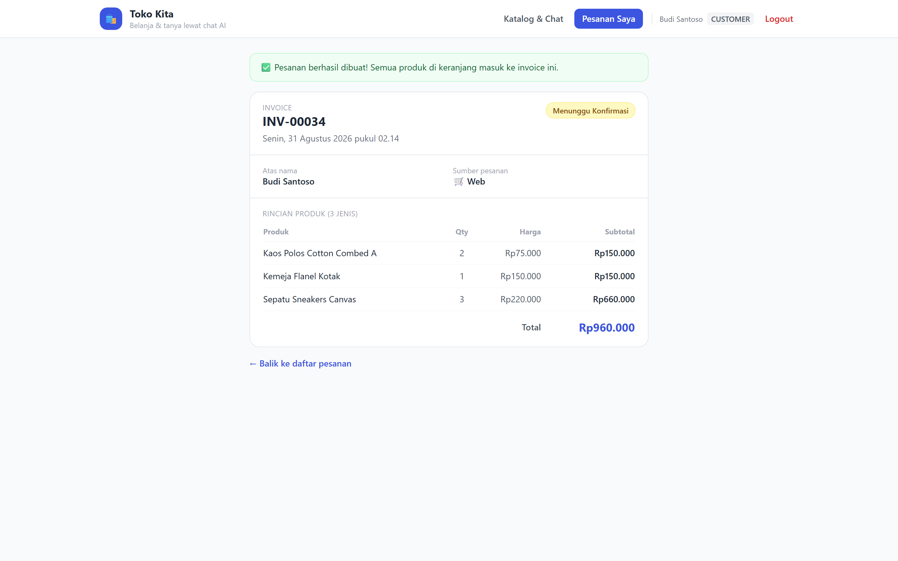

Bukti dari database — 1 baris di `orders`, 3 baris di `order_items`, dan stok tiap
produk berkurang sesuai jumlah yang dipesan:

```
=== ORDERS (1 baris header) ===
{"id":34,"buyerName":"Budi Santoso","total":960000,"status":"diproses","source":"web"}

=== ORDER ITEMS (3 baris untuk 1 order yang sama) ===
{"orderId":34,"productName":"Kaos Polos Cotton Combed A","price":75000,"quantity":2}
{"orderId":34,"productName":"Kemeja Flanel Kotak","price":150000,"quantity":1}
{"orderId":34,"productName":"Sepatu Sneakers Canvas","price":220000,"quantity":3}

=== STOK SESUDAH ORDER (ikut berkurang sesuai qty) ===
{"name":"Kaos Polos Cotton Combed A","stock":48}   // 50 - 2
{"name":"Kemeja Flanel Kotak","stock":19}          // 20 - 1
{"name":"Sepatu Sneakers Canvas","stock":27}       // 30 - 3
```

Total Rp960.000 = (2 × Rp75.000) + (1 × Rp150.000) + (3 × Rp220.000) — cocok dengan
yang tampil di invoice.

Daftar pesanan sisi customer (cuma pesanan miliknya sendiri):

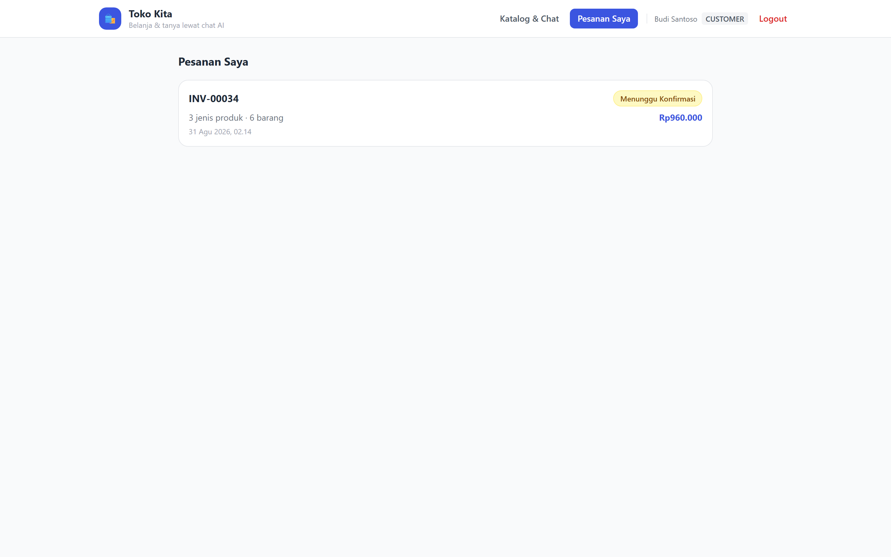

---

## 5. Invoice & Ubah Status Pesanan (Admin)

Daftar semua invoice yang masuk, lengkap dengan jumlah jenis item, total, dan statusnya:

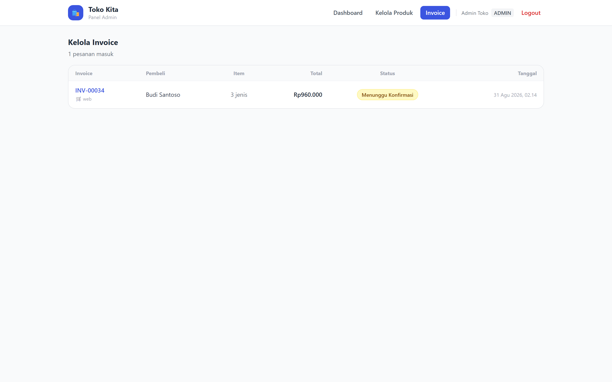

Admin membuka **detail invoice** — rincian tiap produk, qty, harga satuan, subtotal,
dan total. Status awal **Menunggu Konfirmasi** (**before**):

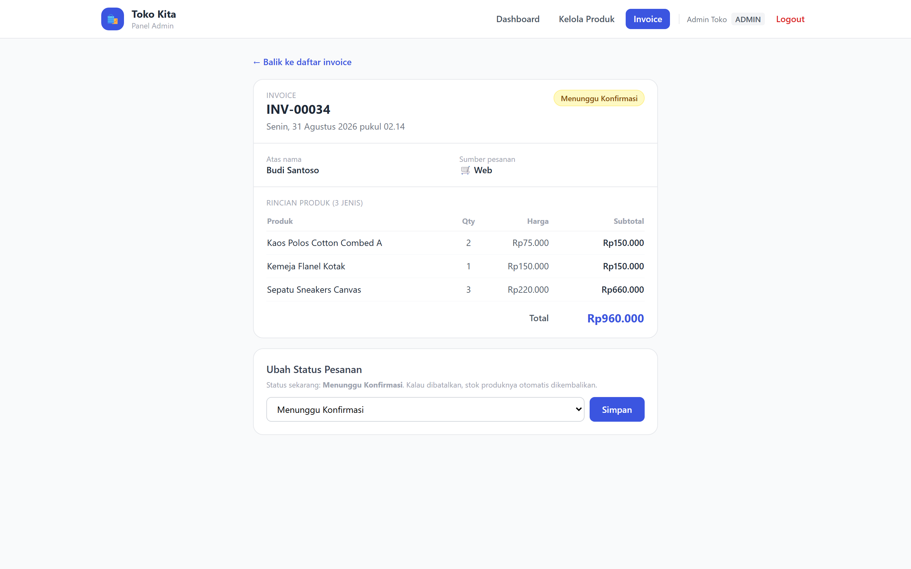

Setelah status diubah lewat dropdown jadi **Diproses** (**after**), muncul notifikasi
perubahan status dan badge-nya ikut berubah warna:

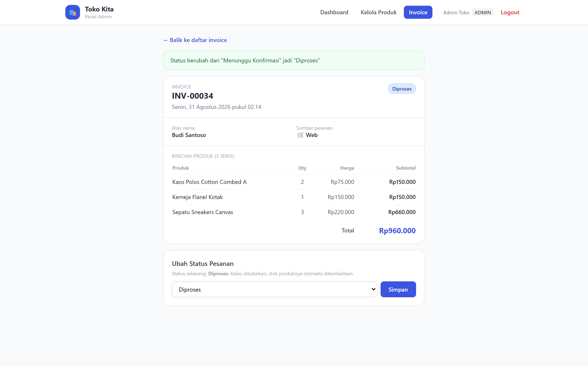

Daftar status ada di [`utils/orderStatus.js`](utils/orderStatus.js):
`pending → diproses → dikirim → selesai`, plus `dibatalkan`.
Kalau pesanan **dibatalkan**, stok produknya otomatis dikembalikan
(`updateOrderStatus()` di `services/order.service.js`).

---

## 6. Tampilan (UI)

Perbaikan tampilan dibanding versi awal:

| Sebelum | Sesudah |
|---------|---------|
| Navbar statis, 2 menu untuk semua orang | Navbar **role-aware** — menu admin & customer beda otomatis |
| Form order nempel di tiap kartu produk | Kartu produk rapi + **keranjang belanja** terpisah |
| Halaman invoice cuma daftar teks | Invoice bergaya nota: tabel item, subtotal, badge status berwarna |
| Gak ada halaman admin | Dashboard admin dengan kartu statistik + tabel pesanan terbaru |
| Gak ada halaman login | Halaman login & register dengan layout terpisah |

Dashboard admin (kartu statistik, pesanan terbaru, aksi cepat):

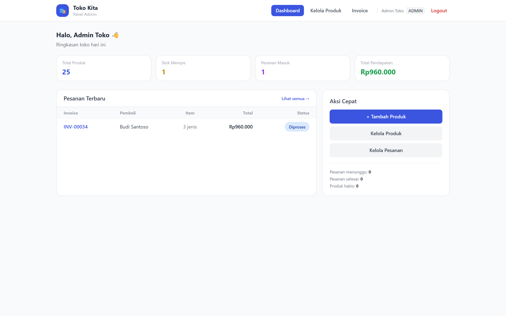

Katalog customer (grid kartu produk, pencarian, keranjang, chat AI):


---

## 7. Penerapan Prinsip DRY

| Bentuk reuse | File | Dipakai di |
|---|---|---|
| **Middleware auth** `requireLogin`, `requireRole()` | `middlewares/auth.middleware.js` | Semua route admin & customer — proteksi ditulis sekali, dipasang di router |
| **Middleware `asyncHandler`** | `middlewares/asyncHandler.js` | Semua controller — menghapus blok `try/catch` yang tadinya diulang di tiap fungsi |
| **Service order** `createOrder()` | `services/order.service.js` | 2 jalur masuk: checkout keranjang web **dan** chat AI (function calling) |
| **Service produk** `getAllProducts()` | `services/product.service.js` | Katalog web, API `/api/products`, halaman admin, command `/stok` bot Telegram |
| **Validasi produk** `validateProductInput()` | `services/product.service.js` | Dipakai `createProduct()` dan `updateProduct()` — aturan validasi ditulis sekali |
| **Helper status** `utils/orderStatus.js` | — | Enum kolom model, dropdown admin, badge di view, teks notifikasi Telegram |
| **Helper `formatRupiah`** | `utils/formatRupiah.js` | Semua view (via `app.locals`), service, dan bot |
| **Partial `nav.ejs`** | `views/partials/` | Semua halaman — isinya menyesuaikan role sendiri |
| **Partial `invoice-detail-body.ejs`** | `views/partials/` | Halaman invoice **customer** dan **admin** — rincian invoice ditulis sekali |
| **Partial `status-badge`, `badge`, `stat-card`, `head`** | `views/partials/` | Dipakai berulang di dashboard, tabel, dan daftar invoice |
| **`app.locals` helper** | `app.js` | `formatRupiah`, `getStatusLabel`, `getStatusColor` tersedia di semua view tanpa dioper manual tiap `res.render()` |

Contoh paling jelas — satu fungsi `createOrder()` dipakai dua jalur berbeda:

```js
// controllers/page.controller.js — checkout keranjang (banyak produk)
const result = await orderService.createOrder({
  items, buyerName, userId: req.session.user?.id, source: 'web',
});

// services/gemini.service.js — pesanan dibuat AI lewat function calling
const result = await orderService.createOrder({
  items: [{ productId: product.id, quantity: Math.round(jumlah) }],
  buyerName: namaPembeli, source: 'chat-ai',
});
```

Logic cek stok, potong stok, simpan item, hitung total, dan notifikasi Telegram ke
admin cuma ditulis **sekali** — kedua jalur otomatis dapat perilaku yang sama.

---

## Hasil Pengujian

Diuji otomatis lewat browser (24 skenario, semuanya lolos):

| Kelompok | Yang diuji | Hasil |
|---|---|---|
| Login 2 role | admin → `/admin`, customer → `/`, customer ditolak di halaman admin | ✅ |
| Data produk | katalog menampilkan 25 produk | ✅ |
| Multiple order | 3 jenis produk masuk 1 invoice, total & qty benar, 3 baris item tersimpan | ✅ |
| Invoice admin | detail invoice tampil, status berubah + notifikasi | ✅ |
| CRUD produk | create, update, delete berhasil; validasi harga ≤ 0 ditolak server | ✅ |
| Dashboard | statistik produk & pendapatan tampil | ✅ |

## Cara Menjalankan

```bash
# 1. buat database dulu
CREATE DATABASE telegram_shop_db;

# 2. copy .env.example jadi .env, isi kredensial DB
npm install
npm run seed     # 25 produk + 3 user (1 admin, 2 customer)
npm run dev      # buka http://localhost:3000
```

Token Telegram & API key Gemini opsional — kalau dikosongkan, aplikasi web tetap
jalan normal (notifikasi Telegram & chat AI otomatis dinonaktifkan).
